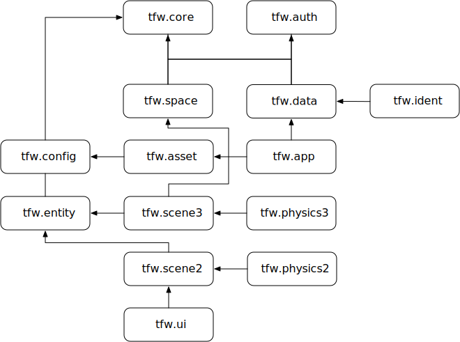

# tfw.platform

Sketchy beginnings of tfw social multiplayer web game platform.

The twisty maze of passages will eventually look something like this:



## Building

Presently the code consists of a single NPM package, `tfw-platform`, which exposes all platform
code, and a separate demo project which depends on the `tfw-platform` package. This will probably
change in the future when I finally determine the least terrible way to ship non-trivial software
with NPM, but that's already looking like a long road.

Thanks to a number of not so forward thinking design decisions on the part of NPM and a trail of
evolutionary tears as new complexities in the JavaScript ecosystem were shoe-horned into the meager
initial design, the layout of the platform project is a bit strange.

Assuming you've checked out the `platform` Github project somewhere, you must first build it (these
instructions are for Unix-like OSes, if you're on Windows you'll have to translate into your
preferred native shell language):

```sh
cd platform/src
yarn install
yarn build
```

Now you can build and run the demo project:

```sh
cd ../demo
yarn install
yarn start
```

This will start a dev server on localhost:3000 which will serve up the simple demo app.

### Iterating on platform & demo

If you want to work on `platform` and `demo` at the same time (or even just work on `platform` but
see the changes reflected in `demo` without major machinations), you have to jump through the `yarn
link` hoops.

Note: we need to link the `platform/lib` directory *not* the `platform/src` directory:

```sh
cd platform/lib
yarn link
cd ../demo
yarn link tfw-platform
```

Now when you make changes to code in `platform/src`, you run `yarn build` (in `platform/src`) and
they will be detected by the webpack hot reloader in `platform/demo` and the demo app will be
automatically reloaded.
